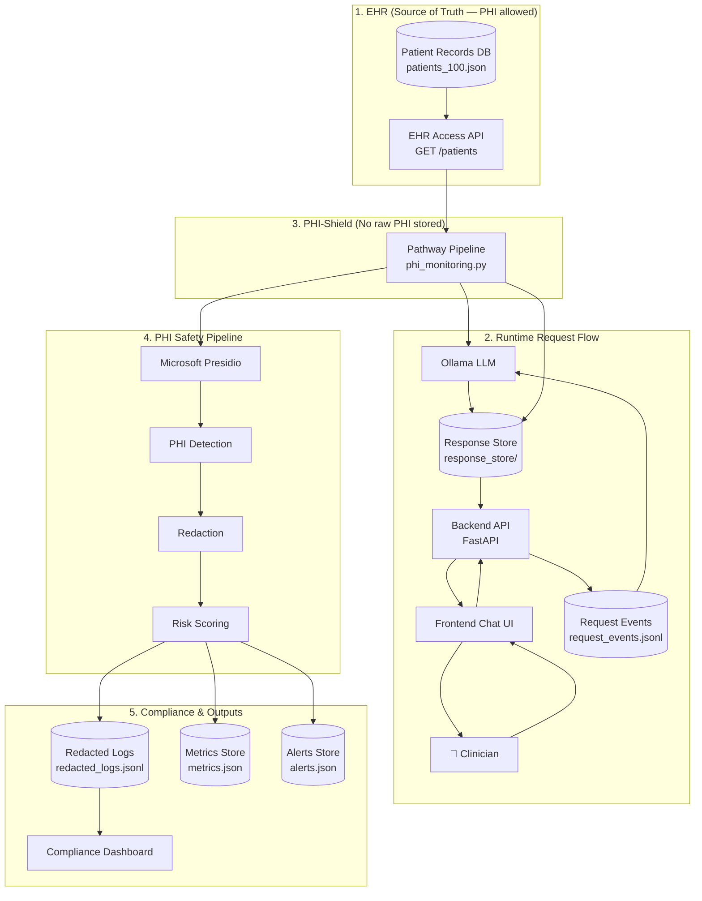

# PHI-Shield

A HIPAA-compliant PHI (Protected Health Information) monitoring system for clinical LLM workflows. Ensures patient data is redacted in audit logs before storage while clinicians see full answers in the chat UI.

## Problem

When clinicians use an LLM to query patient data, the system logs both questions and answers—which may contain PHI (names, SSNs, MRNs, dates, medications). Storing these logs as-is violates HIPAA. PHI-Shield detects and redacts PHI in real time before anything is written to disk.

## Architecture

The system splits responsibilities:

- **FastAPI server** — Accepts user questions, writes request events, and returns LLM answers. It does not call the LLM or perform redaction.
- **Pathway pipeline** — Consumes request events, calls Ollama (local LLM), runs PHI redaction, writes redacted logs and metrics, and stores the answer for the API to return.

### Architecture Diagram



### Data Flow Summary

```
User question → API appends to request_events.jsonl
                     ↓
Pathway reads → Ollama (LLM) → Redact (Presidio/regex) → redacted_logs.jsonl
                     ↓
              response_store/{id}.json (raw answer for API)
                     ↓
API reads answer → Returns to user
```

Dashboards read only from `redacted_logs.jsonl`, `metrics.json`, and `alerts.json`—no raw PHI is stored.

## Requirements

- Python 3.11 or 3.12 (required for Pathway/pyarrow)
- [Ollama](https://ollama.com) — local LLM (no cloud API key)
- Node.js — for frontend build

## Setup

### Backend

```bash
cd backend
python3.12 -m venv .venv
source .venv/bin/activate   # Windows: .venv\Scripts\activate
pip install -r requirements.txt
```

Optional: for better Presidio NER (person, location):

```bash
python -m spacy download en_core_web_lg
```

### Ollama

1. Install from [ollama.com](https://ollama.com)
2. Run: `ollama serve`
3. Pull a model: `ollama pull llama3.2`

### Frontend

```bash
cd frontend
npm install
npm run build
```

## Running the Application

You need **three processes**:

**Terminal 1 — API server**
```bash
cd backend && source .venv/bin/activate
python -m uvicorn app.server:app --reload --host 0.0.0.0 --port 8000
```

**Terminal 2 — Pathway PHI pipeline**
```bash
cd backend && source .venv/bin/activate
PYTHONPATH=. python -m pipeline.phi_monitoring
```

**Terminal 3 — Frontend**
```bash
cd frontend && npx http-server -p 8080 -o
```

Open http://localhost:8080, log in, then use the Chatbot. The `/ask` endpoint waits for the Pathway pipeline to process each request—ensure the pipeline is running or requests will time out.

## Seed Sample Data

To pre-populate the compliance dashboard with sample redacted logs:

```bash
cd backend
PYTHONPATH=. python -m scripts.seed_logs
PYTHONPATH=. python -m app.metrics_alerts
```

## Project Structure

```
docs/
└── architecture.html   # Interactive diagram — pan, zoom, click nodes

backend/
├── app/
│   ├── server.py      # FastAPI: /ask, /patients, /logs, /metrics, /alerts
│   ├── llm.py         # Ollama client, patient context, answer generation
│   ├── redaction.py   # Presidio + regex PHI detection and redaction
│   ├── metrics_alerts.py
│   └── config.py      # Paths (data dir, logs, etc.)
├── pipeline/
│   └── phi_monitoring.py   # Pathway: reads request_events → LLM → redact → logs
├── data/
│   ├── patients_100.json   # Patient records for LLM context
│   ├── request_events.jsonl   # API writes, Pathway reads
│   ├── redacted_logs.jsonl   # Pathway writes (redacted only)
│   ├── response_store/      # Temporary: Pathway writes answer, API reads
│   ├── metrics.json
│   └── alerts.json
└── scripts/
    └── seed_logs.py

frontend/
├── pages/             # chatbot, compliance, phi-access, log-details, access-policy
├── src/               # TypeScript source
└── js/                # Compiled JavaScript
```

## API Endpoints

| Endpoint | Description |
|----------|-------------|
| POST /ask | Submit question; returns LLM answer (Pathway processes in background) |
| GET /patients | List patients |
| GET /patients/{id} | Patient detail |
| GET /logs | Redacted logs (paginated) |
| GET /logs/{id} | Single redacted log |
| DELETE /logs | Clear all logs, reset metrics/alerts |
| GET /metrics | Dashboard metrics |
| GET /alerts | Compliance alerts |

## Redaction

- **Primary:** Microsoft Presidio detects PERSON, EMAIL, PHONE, DATE_TIME, US_SSN, LOCATION, and other PII/PHI entities; replaces with `########`.
- **Fallback:** Regex patterns for SSN, MRN, dates (including month-name formats), emails, phones, doctor/patient names.
- **Risk severity:** Derived from PHI types found (LOW, MEDIUM, HIGH). Stored in redacted logs for compliance dashboards.

Clinicians see the **full** LLM answer in the chat. Only redacted text is written to `redacted_logs.jsonl` and shown in the compliance dashboard.

## Troubleshooting

| Issue | Solution |
|-------|----------|
| "Failed to load patients" (404) | Ensure backend is running on port 8000; start from `backend/` directory |
| `/ask` times out | Start the Pathway pipeline (`python -m pipeline.phi_monitoring`) |
| Ollama errors | Run `ollama serve` and `ollama pull llama3.2` |
| Presidio fails | Falls back to regex; optional: `pip install spacy` and `python -m spacy download en_core_web_lg` |

## License

See project license file.
